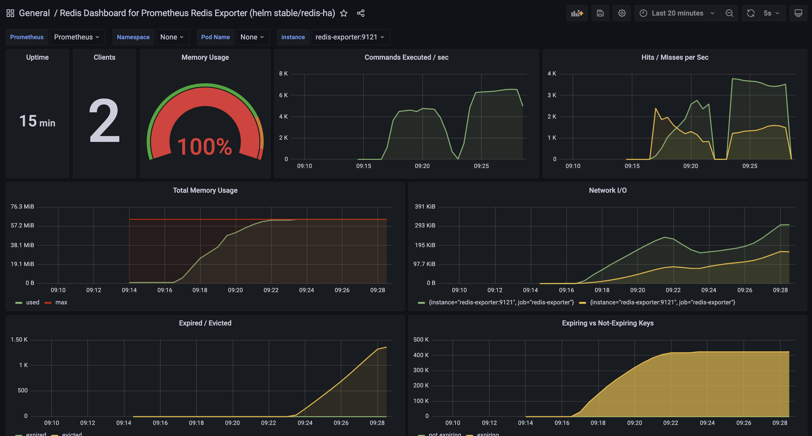

### **캐시 정책 (LFU) 성능 테스트: 5,000 iters/s 부하**

이 문서는 **`allkeys-lfu`** 정책이 적용된 Redis 캐시의 성능을 Skewed 워크로드 환경에서 측정하기 위해 수행된 테스트의 상세 결과입니다.

#### 🟢 테스트 환경 및 설정

| 항목 | 내용 |
| :--- | :--- |
| **테스트 목표** | 주어진 부하에서 성공률 98% 이상을 달성하는지 검증 |
| **테스트 도구** | k6 |
| **캐시 정책** | **`allkeys-lfu`** |
| **테스트 데이터** | 500만 건의 URL |
| **테스트 부하** | **5,000 iterations/s** |
| **테스트 기간** | 5분 |

#### 🟢 실제 테스트 결과 및 결론

**결과: PASS**

| 지표 | 값 | 분석 |
| :--- | :--- | :--- |
| **성공률** | **99.96%** | 목표인 98%를 크게 상회하며 **성공**. |
| **총 요청 수** | 1,498,386건 | - |
| **평균 응답 시간** | **2.25ms** | LRU 대비 약 6배 빠른 응답 속도를 보임. |
| **p95 응답 시간** | **4.3ms** | LRU 대비 약 14배 빠른 응답 속도로, 매우 뛰어난 성능을 보임. |

#### 최종 결론

`allkeys-lfu` 정책은 초당 5,000건의 Skewed 요청을 **매우 우수한 성능으로 처리**하며, 동일한 조건의 LRU 정책보다 모든 지표에서 월등한 결과를 기록했습니다.
