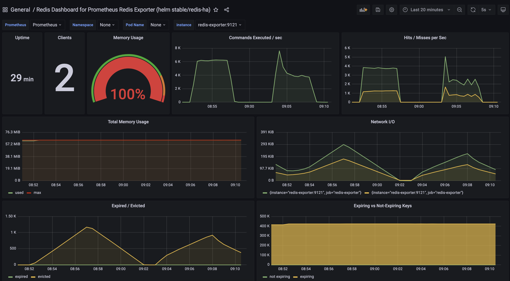

### **캐시 정책 (LRU) 성능 테스트: 7,000 iters/s 부하**

이 문서는 **`allkeys-lru`** 정책이 적용된 시스템의 한계점을 파악하기 위해 부하를 높여 수행된 테스트의 상세 결과입니다.

#### 🟢 테스트 환경 및 설정

| 항목 | 내용 |
| :--- | :--- |
| **테스트 목표** | 주어진 부하에서 성공률 98% 이상을 달성하는지 검증 |
| **테스트 도구** | k6 |
| **캐시 정책** | **`allkeys-lru`** |
| **테스트 데이터** | 500만 건의 URL |
| **테스트 부하** | **7,000 iterations/s** |
| **테스트 기간** | 5분 |

#### 🟢 실제 테스트 결과 및 결론

**결과: FAIL**

| 지표 | 값 | 분석 |
| :--- | :--- | :--- |
| **성공률** | **24.07%** | 목표인 98%에 크게 미달하며 **실패**. |
| **총 요청 수** | 1,116,723건 | 대량의 요청 누락(dropped iterations) 발생. |
| **평균 응답 시간** | 2.25초 | 응답 시간이 초 단위로 급증하여 사용 불가 수준. |
| **p95 응답 시간** | 3.57초 | 대부분의 요청이 심각한 지연을 겪음. |

#### 최종 결론

`allkeys-lru` 정책을 사용하는 시스템은 초당 7,000건의 요청을 감당하지 못하고 **성능 저하 및 병목 현상**이 발생합니다. 성공률이 급락하고 응답 시간이 폭증하여 시스템이 한계점에 도달했음을 확인했습니다.
